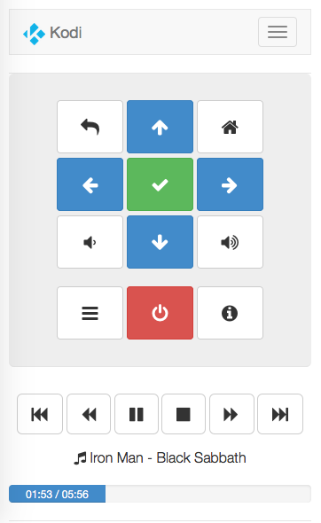

# Kodi Angular

This is a web interface for the entertainment center [Kodi](http://kodi.tv/), using AngularJS.

It uses [Bootstrap](http://getbootstrap.com/) for the design, and communicate through web sockets with Kodi.

Moreover, it is designed as a responsive interface.

### Remote Control and Player

Here is a preview of what the remote control interface looks like on desktop:

Here is the mobile version:

### Libraries

For now, there are basic tables to see and play movies, tv shows or music:

## Installation

You need to install XBMC 12.0 or upper, as it uses [Kodi JSON-RPC API v6](http://kodi.wiki/view/JSON-RPC_API) through WebSocket technology. Because of web sockets, a modern browser is required.

### On Kodi

External control of the application must be authorize, to do so, on Kodi, go to :
> System > Services > Remote Control

And allow control for other application from both inside and outside the system.

### On your machine

You'll need __Npm__ and __Bower__ for packages dependencies, as well as __Grunt__ to run your application.

To connect the Angular app with Kodi, rename the file _app/scripts/config.js.example_ to _app/scripts/config.js_

Then, change the value of the constant named *KODI_URL* to the IP / domain of Kodi.
